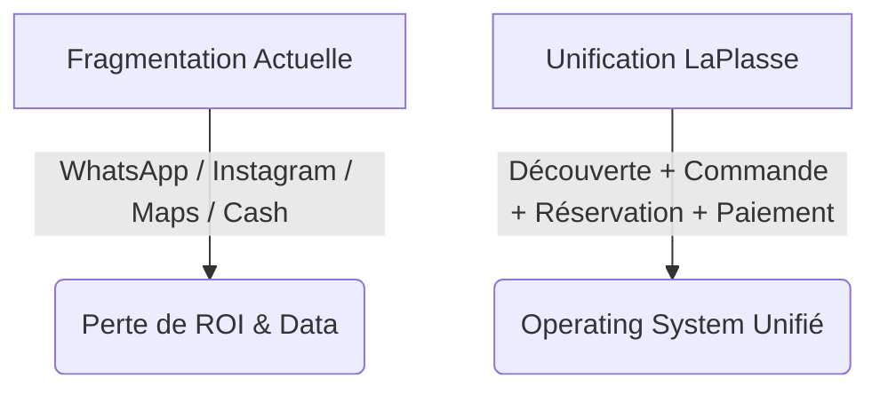
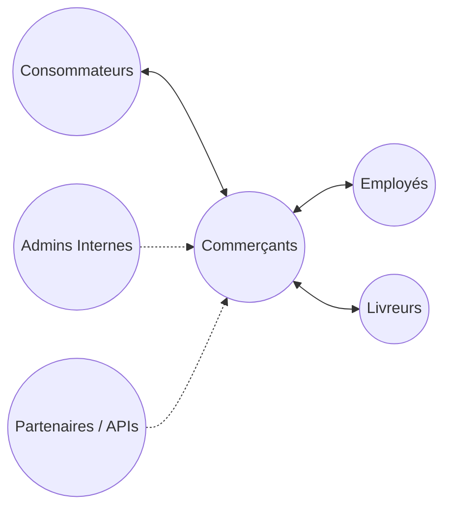
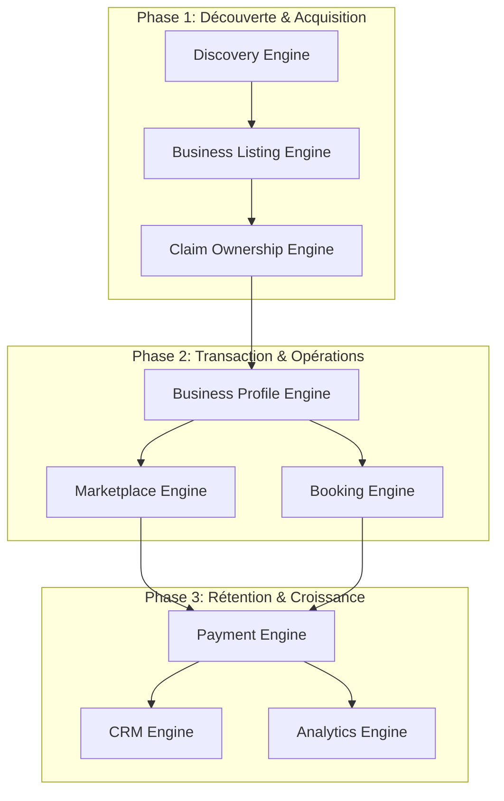
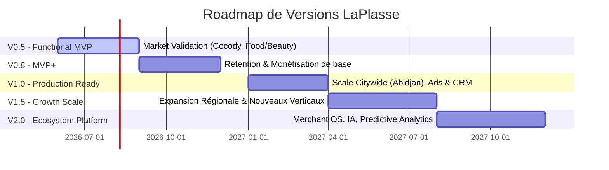

# Rapport de Compréhension Global — LaPlasse

Ce document présente une synthèse analytique et technique approfondie des huit volumes composant l'architecture de produit et le system design de **LaPlasse**.

---

## 1. Vision Stratégique & Positionnement (Tome 0 & Tome 1)

LaPlasse se positionne comme **l'infrastructure digitale de référence (Operating System) pour les commerces locaux en Afrique**. 

### Le Problème Structurel
Aujourd'hui, les PME africaines souffrent d'une **digitalisation fragmentée** : la visibilité se fait sur Google Maps ou Instagram, l'interaction client sur WhatsApp, et les transactions en liquide ou par Mobile Money manuel. Cette fragmentation nuit à la conversion, à l'expérience utilisateur et empêche l'exploitation des données.

### La Solution LaPlasse
LaPlasse unifie cet écosystème au sein d'une **super plateforme locale** combinant découverte, commande, réservation et outils SaaS.



### Plan de Déploiement Geographique
*   **Phase 1 (Lancement) :** Côte d'Ivoire (Abidjan, Bouaké, Yamoussoukro, San Pedro).
*   **Phase 2 (Expansion) :** Sénégal, Ghana, Bénin, Togo, Guinée.
*   **Phase 3 (Régionalisation) :** Afrique francophone et anglophone globale.

### Marchés d'Entrée Prioritaires (Wedge Markets)
1.  **Food & Beverage :** Restaurants, Maquis, Fast-Foods (fréquence et viralité élevées).
2.  **Boutiques & Retail :** Prêt-à-porter, Électronique (ecommerce naturel).
3.  **Beauty & Wellness :** Salons, Spas (réservation récurrente).

---

## 2. Écosystème Utilisateur & Personas (Tome 2)

LaPlasse est une plateforme multilatérale (**multi-sided**) impliquant six acteurs interdépendants.



### Profils Utilisateurs Clés

| Type d'Acteur | Persona Principal | Caractéristiques & Comportement | Fonctionnalités Clés Requises |
| :--- | :--- | :--- | :--- |
| **Consommateur** | *The Explorer* & *Convenience Consumer* | Mobile-first, recherche d'avis vérifiés, usage intensif de WhatsApp. | Recherche géographique, commande WhatsApp native, badges de confiance. |
| **Commerçant** | *Small Informal Merchant* | Faible maturité digitale, craint la complexité technique, gère par cash/OM. | Onboarding < 5 min, interface ultra-simplifiée, dashboard de ventes basique. |
| **Commerçant** | *Growing & Chain Business* | Niveau numérique intermédiaire à avancé, cherche à optimiser son flux. | Gestion multi-sites, CRM, permissions staff, analyses avancées. |
| **Staff** | *Branch Manager / Cashier* | Opérateurs quotidiens du commerce physique. | Rôles limités, traitement rapide des commandes et réservations. |

---

## 3. Architecture Fonctionnelle & Moteurs Clés (Tome 3)

La modularité est le principe directeur : chaque type de business n'active que les fonctionnalités dont il a besoin.



### Les 6 Moteurs Majeurs

1.  **Discovery Engine :** Moteur de recherche hybride (textuel, sémantique et par intention), tolérant aux fautes, avec géolocalisation optimisée pour l'Afrique (recherche basée sur les repères visuels ou *landmarks*, ex. "en face de la pharmacie").
2.  **Claim Ownership Engine :** Système inspiré de *Google Business Profile*. Les fiches peuvent être créées par la plateforme ou les utilisateurs. Le propriétaire la revendique via OTP (téléphone), validation de document ou réseaux sociaux.
3.  **Marketplace Engine :** Ecommerce natif avec gestion des variantes, du stock et un panier intelligent multi-boutiques (permettant un paiement groupé mais éclatant les commandes en interne).
4.  **Booking Engine :** Moteur universel et configurable de réservation (tables pour les restaurants, créneaux horaires pour les salons, chambres pour les hôtels).
5.  **Messaging & WhatsApp Engine :** Intégration de WhatsApp comme canal natif de commande, de réservation et de notification, sans forcer les utilisateurs informels à changer leurs habitudes.
6.  **Payment Engine :** Abstraction multi-providers supportant en priorité le **Mobile Money** (Orange, MTN, Moov, Wave) et les cartes bancaires, avec gestion des paiements partagés (*split payments*) et versements automatisés aux marchands.

---

## 4. Systèmes Verticaux Spécifiques (Tome 4)

Les fonctionnalités se structurent en modules spécialisés greffés sur un socle commun (*Core Business*) :

*   **Restaurant System :** Intègre les menus interactifs (variantes, suppléments), la commande en livraison/retrait et le placement de table.
*   **Boutique & Retail System :** Se focalise sur les SKU, la gestion fine des stocks et des alertes, et les campagnes de codes promotionnels.
*   **Beauty & Salon System :** Repose sur le calendrier de disponibilité du staff, la durée estimée des soins et la fidélisation par cartes de fidélité virtuelles.

---

## 5. Architecture de Données & Domain-Driven Design (Tome 5)

Pour éviter un schéma monolithique rigide, LaPlasse implémente le **Domain-Driven Design (DDD)** découpé en contextes bornés (*Bounded Contexts*) isolés et communicant via des **événements de domaine**.

```mermaid
graph TD
    subgraph Identity Context
        U[User] --> UP[UserProfile]
        U --> UR[UserRole]
    end
    subgraph Business Context
        B[Business] --> BB[BusinessBranch]
        B --> BH[BusinessHours]
        B --> BF[BusinessFeatureFlags]
    end
    subgraph Marketplace Context
        P[Product] --> PV[ProductVariant]
        O[Order] --> OI[OrderItem]
    end
    subgraph Booking Context
        BK[Booking] --> BS[BookingSlot]
    end
    
    Identity Context -.->|Domain Events| Business Context
    Business Context -.->|Feature Flags| Marketplace Context
    Marketplace Context -.->|Split Payout| Payment Context[Payment Context]
```

---

## 6. Architecture Backend (Tome 6)

Le backend est conçu comme un **Monolithe Modulaire** en **NestJS (TypeScript)**, facilitant une transition future vers des microservices si nécessaire.

### Principes Applicatifs
*   **Clean Architecture Simplifiée :** Découpage strict dans chaque module :
    *   *Controllers* (Validation DTO avec `class-validator`, serialization, HTTP endpoints).
    *   *Services* (Logique métier pure et orchestration).
    *   *Repositories* (Abstraction de l'accès aux données via **Prisma**).
*   **Sécurité & Auth :** Authentification par JWT (Access + Refresh Tokens) couplée à un contrôle d'accès basé sur les rôles et permissions (RBAC).
*   **Communication Inter-modules :** Synchrone (interfaces de services pour les données critiques comme les paiements) et Asynchrone (événements pour les notifications, analytics, logs d'audit).

---

## 7. Architecture Frontend & UX System (Tome 7)

Le frontend utilise **Next.js (App Router)** et privilégie une approche **Mobile-First** absolue.

```
src/
├── app/                  # Route Groups: (public), (auth), (dashboard), (admin)
├── components/           # Composants globaux (UI Primitives & Layout)
├── features/             # Organisation par domaine fonctionnel (business, booking, etc.)
│   └── marketplace/
│       ├── components/   # Composants spécifiques (ProductCard, etc.)
│       ├── hooks/        # custom React Hooks pour le domaine
│       ├── services/     # Appels API du domaine
│       └── types/        # Déclarations TypeScript
```

### Stratégie de Performance & Gestion d'État
*   **Network Constraint Handling :** Optimistic UI, skeleton loading, compression des images, lazy loading pour s'adapter aux connexions mobiles africaines fluctuantes.
*   **Zustand :** Utilisé pour l'état client global minimal (panier, authentification, thème).
*   **TanStack Query :** Utilisé pour la synchronisation de l'état serveur (fetching, mutation, mise en cache avec stratégies de péremption strictes).

---

## 8. UX Blueprint & Design System (Tomes 8 & 13)

La philosophie design repose sur quatre piliers : **Simple, Fast, Trusted, Delightful**. L'objectif est de réduire la friction du premier clic à la fidélisation, avec une architecture en 5 étapes : *Discover → Trust → Action → Transaction → Retention*.

*   **Design Visuel :** Premium, moderne et clean, inspiré des standards mondiaux (Airbnb, Uber Eats) mais adapté aux réalités africaines.
*   **Principes UX :**
    *   **Mobile-First / Thumb-first UX :** Navigation optimisée pour une utilisation à un pouce (CTA toujours en bas de l'écran).
    *   **Fast Discovery :** Maximum 3 clics pour trouver un commerce.
    *   **Trust First :** Mise en avant systématique des avis, vérifications, photos et horaires.
    *   **Progressive Disclosure :** Ne pas surcharger l'utilisateur d'informations ; montrer l'essentiel d'abord (photos, rating, CTA).

---

## 9. Monétisation & Business Model (Tome 9)

Le modèle économique repose sur **7 piliers de revenus** pour garantir la résilience et ne pas étouffer les marchands par un paywall prématuré :
1.  **SaaS Subscriptions :** Modèle freemium (Free, Starter, Growth, Premium) avec tarification localisée selon le pays.
2.  **Commissions :** Variables selon le vertical (plus faibles pour les restaurants, moyennes pour l'ecommerce, etc.).
3.  **Sponsored Placement :** Visibilité boostée (top search, category, nearby), toujours clairement identifiée ("Sponsored").
4.  **Ads Marketplace :** Publicités hyperlocales en self-service.
5.  **Premium Features :** Analytics avancés, automatisation CRM, outils de fidélité.
6.  **Booking Monetization :** (Futur) Frais de réservation ou commissions dédiées.
7.  **Financial Services :** (Futur) Services financiers pour marchands.

---

## 10. Croissance, Marketing & Go-To-Market (Tome 10)

La stratégie repose sur la **croissance de marketplace hyperlocale** : dominer un quartier (Cocody) avant de s'étendre à la ville (Abidjan), puis au pays (Côte d'Ivoire).

*   **Wedge Strategy (Marchés d'entrée) :** Commencer par les restaurants, la beauté et les boutiques sélectionnées (haute fréquence d'usage).
*   **Acquisition Supply (Marchands) :** Prospection terrain, WhatsApp, et recommandations. L'objectif est d'atteindre une "masse critique" locale avant toute expansion.
*   **Acquisition Demand (Consommateurs) :** Utilisation de TikTok (découverte locale) et WhatsApp (viralité et partage), complétés par des micro-influenceurs hyperlocaux.
*   **Growth Loops :** Boucles d'avis, référencement marchand/marchand, référencement consommateur, et contenu local.

---

## 11. Système d'Exécution Ingénierie (Tome 12)

LaPlasse utilise une approche d'exécution **Feature-by-Feature (Vertical Slice Development)** pour minimiser la dette technique et faciliter la QA : DB → Schema → API → Validation → Frontend → QA.

*   **Cursor AI Workflow :**
    *   *Règle #1 :* Un prompt = une seule responsabilité.
    *   *Règle #2 :* Template officiel avec Contexte, Objectif, Fichiers, Requis, Contraintes et Checklist de Validation.
*   **Standards d'Ingénierie :** Code typé (TypeScript strict), modulaire, réutilisable et simple. Les erreurs doivent être gérées proprement (pas de 500 génériques).
*   **Git Workflow & QA :** Conventions de commits strictes (feat:, fix:, refactor:), tests récurrents et refactorisation tous les 3 sprints pour stabiliser.

---

## 12. Roadmap Produit & Stratégie MVP (Tome 11)

L'approche produit est **MVP-first, ecosystem-later** pour éviter de construire trop d'un coup.


